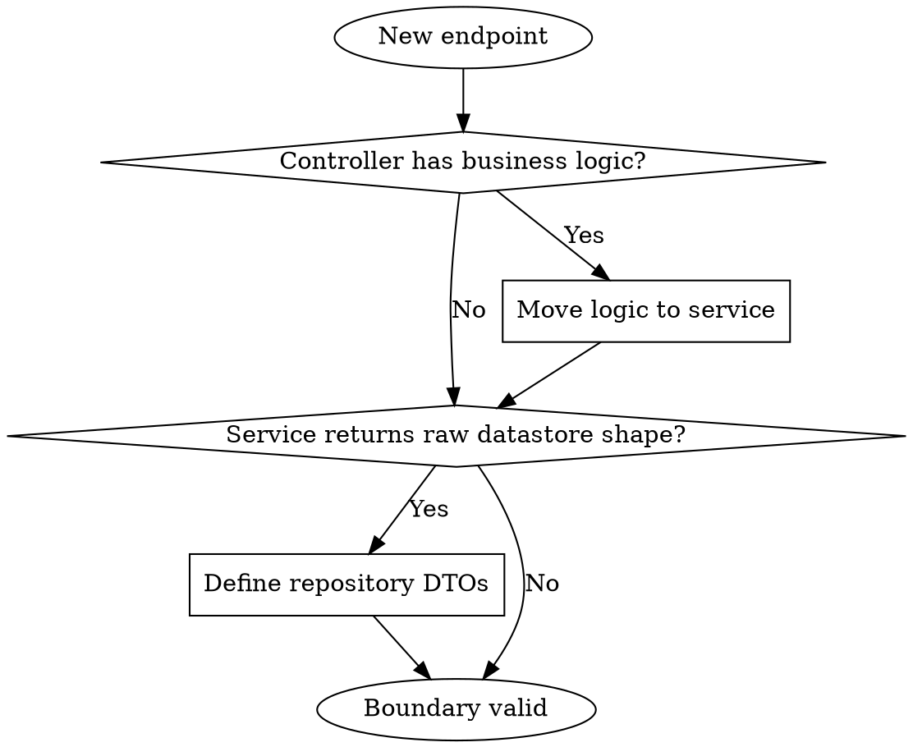

Canonical architecture contract module for Node.js + TypeScript + Express.

## Enforced Structure

```text
src/
|- controllers/   # HTTP mapping only
|- services/      # use-case rules and orchestration
|- repositories/  # persistence mapping and DTO contracts
|- models/
|- middleware/
|- routes/
|- utils/
|- config/
|- types/
```

Structural deviation requires explicit approval.

## Boundary Model

```text
Route -> Controller -> Service -> Repository -> Datastore
Datastore -> Repository mapper -> Repository DTO -> Service -> Controller response
```

- Controllers do not own business rules or persistence logic.
- Services do not return raw datastore shapes.
- Repositories own mapping and explicit DTO outputs.

## Rationalization Table - Architecture Violations

| Excuse                                  | Reality                                                                  |
| --------------------------------------- | ------------------------------------------------------------------------ |
| "Business logic is request-specific"    | Request shaping belongs in controllers; business rules stay in services. |
| "Raw DB rows are fine for now"          | Raw shapes create unstable contracts and downstream breakage.            |
| "Service can know HTTP for convenience" | HTTP-coupled services are harder to reuse and test.                      |
| "Invariants are obvious from code"      | Implicit invariants are unverifiable and easy to violate.                |

## Repository DTO Contract Rules

- Define DTO contracts for query/filter, mutation, and read outputs.
- Keep nullability explicit and deterministic.
- Block sensitive/internal fields unless required by contract.
- Stabilize DTO shape for testability and compatibility.

## Error Taxonomy (Required)

- Validation failures -> 400/422
- Authentication failures -> 401
- Authorization failures -> 403
- Not found -> 404
- Conflict/invariant violations -> 409
- Unexpected/internal failures -> 500

Apply mapping consistently per capability.

## Invariant Discipline

For mutating workflows, preserve:

- Referential consistency
- No orphaned dependents
- Idempotent behavior when required
- Partial-failure handling (transaction, rollback, or compensation)

If invariants cannot be guaranteed, pause and revise artifacts first.

## RED-GREEN-REFACTOR for Architecture Contracts

### RED: Validate boundaries

- **Trigger**: new endpoint planning.
- **Action**: audit route-controller-service-repository boundaries.
- **Verification**: no controller business logic and no raw output leakage.

### GREEN: Define stable contracts

- **Trigger**: boundaries are clean.
- **Action**: define explicit repository DTO inputs and outputs.
- **Verification**: deterministic shape, explicit nullability, sensitive field control.

### REFACTOR: Preserve invariants

- **Trigger**: mutating workflow or partial-failure risk appears.
- **Action**: tighten referential/idempotency/rollback guarantees.
- **Verification**: invariants hold across edge and failure paths.



## Red Flags - Immediate Stop Conditions

- CONTROLLER OWNS BUSINESS RULES.
- SERVICE RETURNS RAW DATASTORE SHAPES.
- MISSING EXPLICIT DTO CONTRACTS.
- INVARIANTS IMPLIED BUT NOT DEFINED.
- STRUCTURAL DEVIATION WITHOUT APPROVAL.

When flagged: **Stop -> isolate violation -> correct boundary/contract -> continue.**

## REQUIRED BACKGROUND

- **REQUIRED** `openspec-proposal`
- **REQUIRED** `backend-defensive-engineering`
- **REQUIRED** `backend-runtime-safety-lifecycle`

Related: `backend-redis-application-patterns`, `backend-node-init-minimal`.
