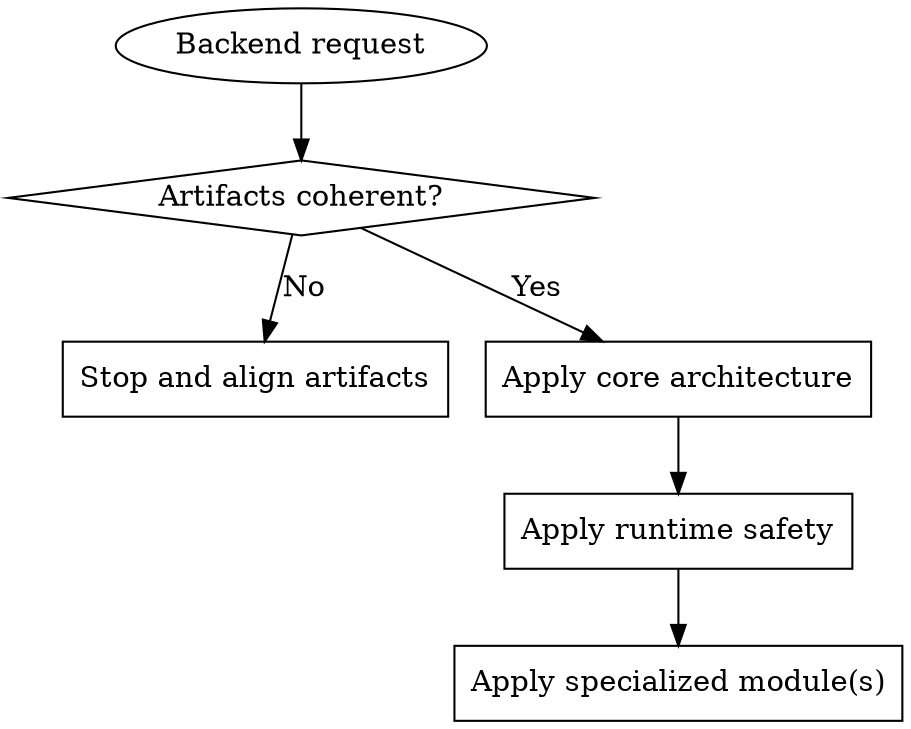

Use this as the entry skill for backend work. It enforces guardrails and routes to companion skills.

## Global Guardrails

- Defensive correctness over speed.
- Proposal-first for non-trivial changes.
- Keep boundaries, invariants, and DTO contracts explicit.
- Keep Redis app behavior separate from Redis infrastructure.

## Delegation Map

- Architecture/DTO/invariants/errors -> `backend-core-architecture-contracts`
- Startup/shutdown/health/dependency criticality -> `backend-runtime-safety-lifecycle`
- Redis app behavior -> `backend-redis-application-patterns`
- Redis app-vs-infra boundary -> `backend-redis-infra-separation`
- Greenfield bootstrap -> `backend-node-init-minimal`

## Deterministic Precedence

When one request spans multiple modules, apply in this order:
1. `backend-core-architecture-contracts`
2. `backend-runtime-safety-lifecycle`
3. Specialized module(s)

## Rationalization Table - Common Objections

| Excuse | Reality |
|--------|---------|
| "This is small, skip proposal" | Small unchecked changes compound into architecture drift. |
| "Mix app and infra for speed" | Mixed concerns hide coupling and create brittle systems. |
| "I already know this pattern" | Familiarity does not replace context-specific validation. |
| "I will document deviations later" | Deferred rationale usually becomes missing rationale. |
| "Routing across skills is overhead" | Explicit routing avoids contradictory guidance and rework. |

## RED-GREEN-REFACTOR for Backend Workflows

### RED: Detect and halt
- **Trigger**: artifacts are missing or incoherent.
- **Action**: stop implementation guidance and restore coherence.
- **Verification**: artifacts exist, align, and match scope.

### GREEN: Route and enforce
- **Trigger**: artifacts are coherent.
- **Action**: route each concern to one owner skill using precedence.
- **Verification**: each requirement has a clear owner.

### REFACTOR: Close loopholes
- **Trigger**: repeated rationalizations or ownership ambiguity.
- **Action**: tighten table, red flags, and precedence notes.
- **Verification**: no unresolved routing ambiguity remains.

## Red Flags - STOP and Reset

- CODE BEFORE COHERENT ARTIFACTS.
- MIXED APP/INFRA CONCERNS IN ONE PATH.
- NO CLEAR OWNER SKILL FOR A RULE.
- UNDOCUMENTED STRUCTURAL DEVIATION.

When flagged: **Stop -> announce -> restore last valid artifact state -> continue.**

## REQUIRED BACKGROUND

- **REQUIRED** `openspec-proposal`
- **REQUIRED** `backend-core-architecture-contracts`
- **REQUIRED** `backend-runtime-safety-lifecycle`
- **REQUIRED AS NEEDED** `backend-redis-application-patterns`, `backend-redis-infra-separation`, `backend-node-init-minimal`

Do not route until prerequisites are loaded.

## Redis Infra Boundary Rule

If the request concerns topology, provisioning, HA, persistence, backup, TLS/ACL, or platform specifics, route to infra guidance.

## Proposal-First Gate

For non-trivial changes, require coherent proposal/design/spec/tasks before implementation guidance.

## Non-Goals

- This orchestrator does not provide database bootstrap wiring.
- This orchestrator does not replace specialized companion skills.
