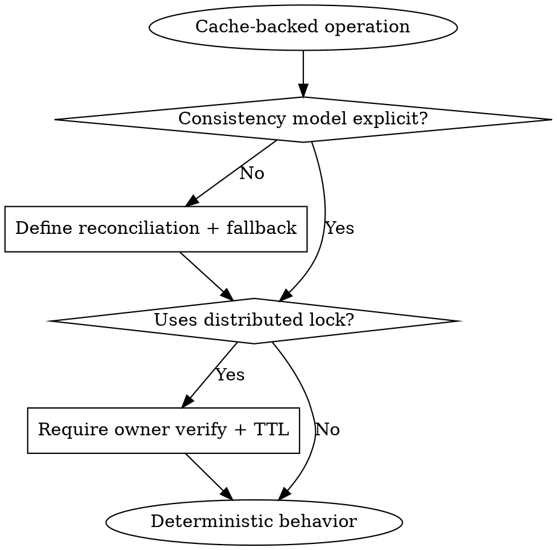

Application-layer Redis behavior module. It excludes Redis provisioning and infrastructure bootstrap.

## Rationalization Table - Redis Behavior Errors

| Excuse | Reality |
|--------|---------|
| "Redis is always available" | Availability assumptions fail during network/platform incidents. |
| "Lock without TTL is simpler" | Missing TTL can deadlock distributed workloads. |
| "Release lock unconditionally" | Unverified release breaks ownership safety. |
| "Cache drift is acceptable" | Drift without reconciliation causes stale/incorrect responses. |
| "Fallback can be implicit" | Implicit fallback makes failure handling non-deterministic. |

## Scope

Use this module for:
- cache/session behavior contracts in backend logic
- lock semantics for distributed single-runner jobs
- consistency and reconciliation behavior between datastore and cache
- fallback policy when Redis is unavailable

## Optional-by-Policy Behavior

Define per capability whether Redis is:
- required (fail-fast)
- optional (degrade-and-warn)

Do not leave behavior implicit.

## RED-GREEN-REFACTOR for Redis Patterns

### RED: Surface policy ambiguity
- **Trigger**: Redis mode or failure behavior is undefined.
- **Action**: identify missing required/optional policy and reconciliation rules.
- **Verification**: ambiguity is explicit before pattern selection.

### GREEN: Apply safe patterns
- **Trigger**: policy is explicit.
- **Action**: apply lock ownership verification, bounded TTL, and reconciliation behavior.
- **Verification**: failure paths are deterministic and observable.

### REFACTOR: Close consistency gaps
- **Trigger**: stale-cache or lock-contention edge cases repeat.
- **Action**: tighten fallback semantics and retry/reconciliation guidance.
- **Verification**: no unresolved stale data or ownership ambiguity remains.



## Red Flags - Redis Behavior Anti-Patterns

- NO FALLBACK POLICY DEFINED.
- LOCK TTL MISSING OR UNBOUNDED.
- LOCK RELEASE WITHOUT OWNER VERIFICATION.
- CACHE RECONCILIATION STRATEGY MISSING.
- FAILURE SIGNALS NOT OBSERVABLE.

When flagged: **Stop -> define deterministic policy -> verify lock and cache safety -> continue.**

## REQUIRED BACKGROUND

- **REQUIRED** `openspec-proposal`
- **REQUIRED** `backend-defensive-engineering`
- **REQUIRED** `backend-core-architecture-contracts`
- **REQUIRED** `backend-runtime-safety-lifecycle`
- **REQUIRED** `backend-redis-infra-separation`

Do not proceed until app/infrastructure separation is clear.

## Single-Runner Distributed Jobs

When multi-instance workloads need one active runner, require lock-based coordination:

```text
acquire lock (set if absent + TTL) -> run job -> release only if owner
```

Require owner verification before release and bounded TTL.

## Cache Consistency and Fallback

- Define reconciliation strategy for cache/source divergence.
- Define post-commit fallback if cache update fails (for example, invalidate stale keys).
- Ensure failures are observable and deterministic.

## Operability Expectations

For manual cache maintenance, expose progress/status semantics (running/completed/failed with bounded retention).
