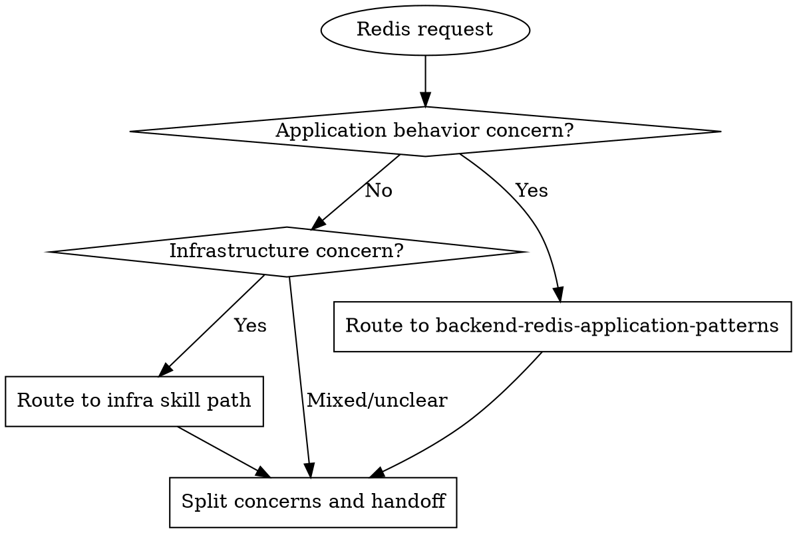

Boundary module for Redis concerns.

## Rationalization Table - Separation Violations

| Excuse | Reality |
|--------|---------|
| "Redis is one topic, keep it together" | Behavior and infrastructure have different owners and rollout paths. |
| "Provisioning details help app guidance" | Embedded infra setup in app guidance creates coupling and drift. |
| "Security hardening is app-level here" | TLS/ACL and topology hardening are infra operations. |
| "We'll split concerns later" | Deferred separation becomes long-term boundary erosion. |
| "Prototype can ignore separation" | Early boundary debt hardens into production architecture risk. |

## Separation Contract

Application-level Redis guidance includes:
- key usage contracts
- lock semantics
- cache consistency/fallback behavior
- session/cache behavior policy in app logic

Infrastructure Redis guidance includes:
- topology/HA design
- persistence/backup strategy
- failover/disaster recovery
- TLS/ACL and platform deployment

Do not merge these concern sets in one implementation plan.

## Handoff Rule

When app-level patterns depend on infra capabilities, document assumptions and handoff requirements without embedding provisioning steps.

## RED-GREEN-REFACTOR for Separation Enforcement

### RED: Classify concern type
- **Trigger**: request includes mixed Redis scope signals.
- **Action**: classify each concern as app behavior or infrastructure.
- **Verification**: no ambiguous concern remains unclassified.

### GREEN: Route by boundary
- **Trigger**: classification is complete.
- **Action**: route app behavior to app pattern skill and infra concerns to infra path.
- **Verification**: no cross-boundary implementation leakage remains.

### REFACTOR: Tighten handoffs
- **Trigger**: boundary confusion repeats.
- **Action**: strengthen handoff assumptions and escalation wording.
- **Verification**: mixed concerns are consistently split and routed.

## Red Flags - Boundary Breaches

- PROVISIONING STEPS INSIDE APP GUIDANCE.
- APP LOGIC GUIDANCE INSIDE INFRA TOPOLOGY SECTION.
- NO EXPLICIT HANDOFF ASSUMPTIONS.
- MIXED CONCERN PLAN WITHOUT SPLIT.

When flagged: **Stop -> split concern sets -> route each path -> continue.**

## REQUIRED BACKGROUND

- **REQUIRED** `openspec-proposal`
- **REQUIRED** `backend-defensive-engineering`
- **REQUIRED** `backend-redis-application-patterns`

## Escalation Trigger

If request includes provisioning, cluster management, infra security hardening, or platform-specific Redis operations, route to infra skill path.
